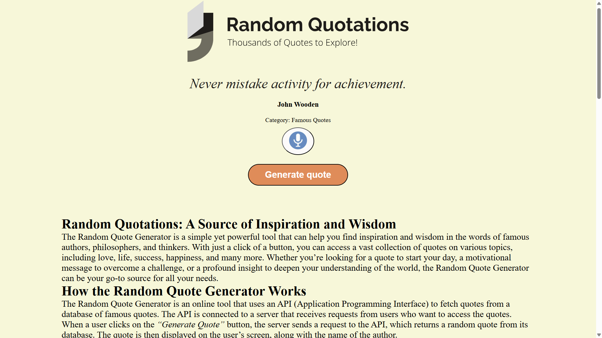
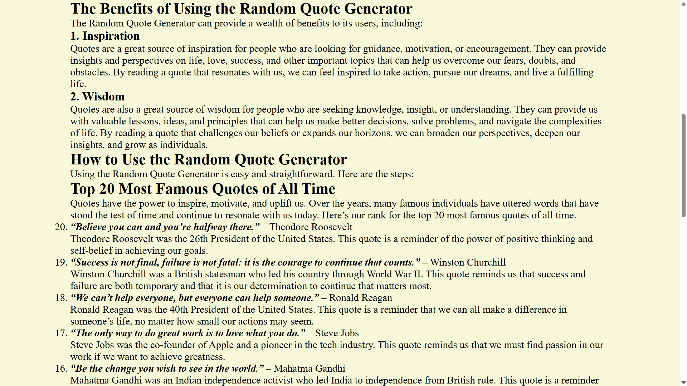
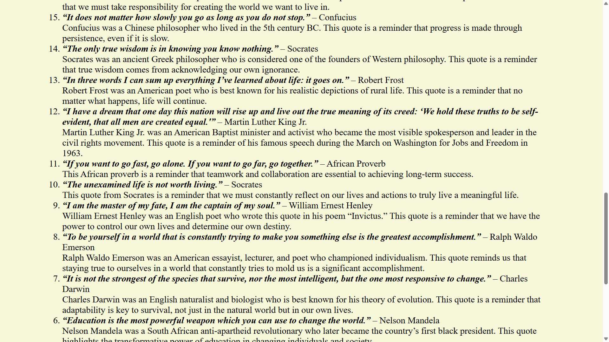
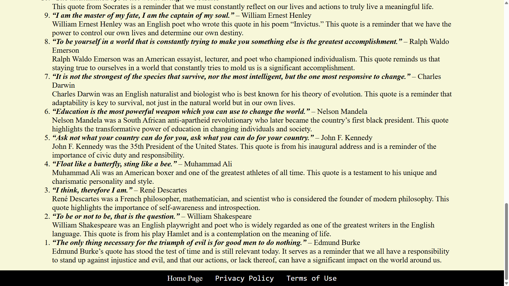

# Quotesphere

Quotesphere is a simple web application that fetches quotes from an API and provides a function to speak text aloud. It also includes a curated list of "Top 20 Most Famous Quotes of All Time."

## Overview

The Overview section of Quotesphere gives a brief introduction to the application, its purpose, and key features. Users can quickly understand what Quotesphere offers app delivering diverse, inspiring quotes. Users access wisdom and motivation from renowned sources, enhancing daily life with thought-provoking insights and uplifting messages in a simple interface.

version 1 is hosted [HERE!](https://anandraj012.github.io/Random-Quotations/)

## Features

- Fetches quotes from a remote API using JavaScript.
- Displays a collection of quotes on the user interface.
- Provides a function to speak out the selected quote using the Web Speech API.

## Technologies Used

- HTML5
- CSS3
- JavaScript (ES6+)

API Used
Quotesphere fetches quotes from the [Quotes API](https://api.quotable.io/random).

## Screenshots






## Installation

1. Clone the repository:

   ```bash
   git clone https://github.com/ANANDRAJ012/Random-Quotations.git
   
   Feel free to explore and build upon this project to create a fully functional quotesphere application. For any questions or assistance, please don't hesitate to reach out to us. Happy coding and happy shopping!